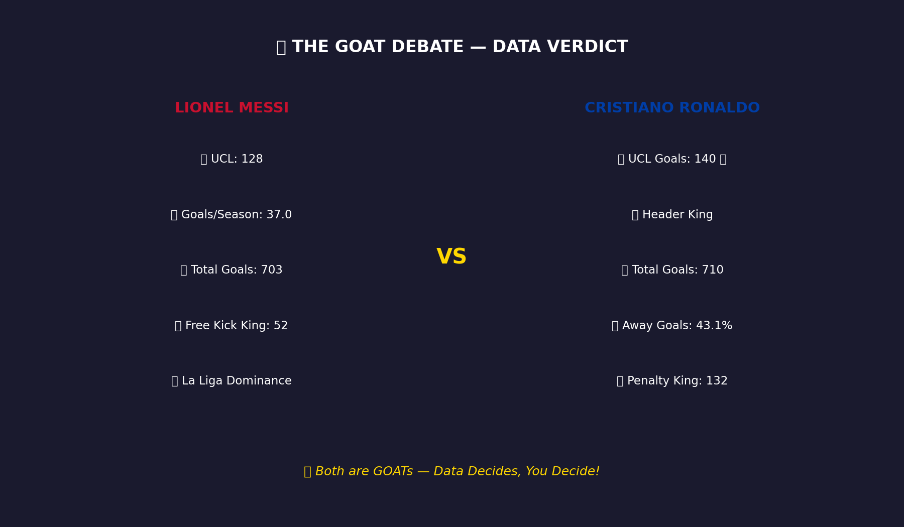
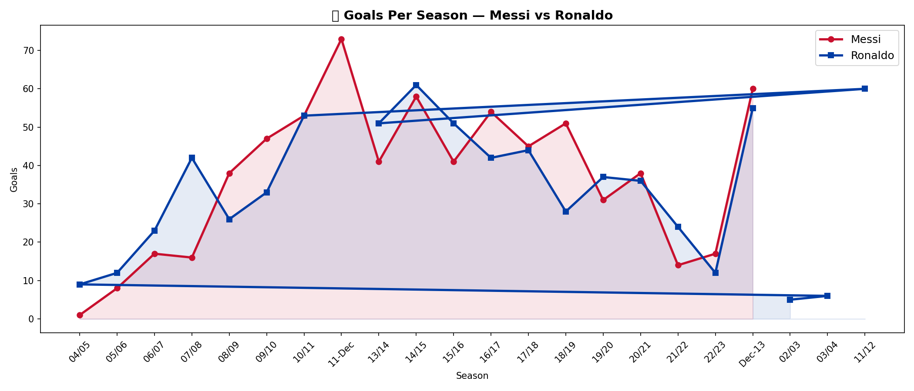
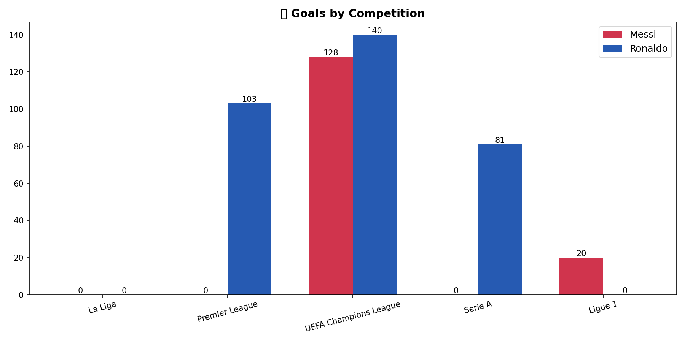

# 🐐 The GOAT Debate — Ronaldo vs Messi Data Analysis

> Settling the greatest football debate using data science — EDA, visualization, and ML clustering on 1,413+ career goals.

## 📊 Project Highlights

- **Career Comparison:** 703 vs 710 total club goals across 19-21 seasons
- **UCL Dominance:** Ronaldo leads 140 vs 128 in Champions League
- **Efficiency:** Messi scores 37.0 goals/season vs Ronaldo's 33.8
- **ML Clustering:** K-Means analysis reveals 3 distinct playing styles
- **Verdict:** Both are GOATs — data decides, you decide!

## 🛠️ Tech Stack

- **Language:** Python
- **Libraries:** Pandas, NumPy, Matplotlib, Scikit-learn
- **ML:** K-Means Clustering
- **Tools:** Jupyter Notebook

## 📈 Key Visualizations





## 🚀 How to Run
```
git clone https://github.com/Mihi2724/Ronaldo-Messi-GOAT-Analysis
cd Ronaldo-Messi-GOAT-Analysis
pip install -r requirements.txt
jupyter notebook Goat_analysis.ipynb
```

## 🔗 Connect
[LinkedIn](https://linkedin.com/in/mihika-jain-27b093271) 
[GitHub](https://github.com/Mihi2724
